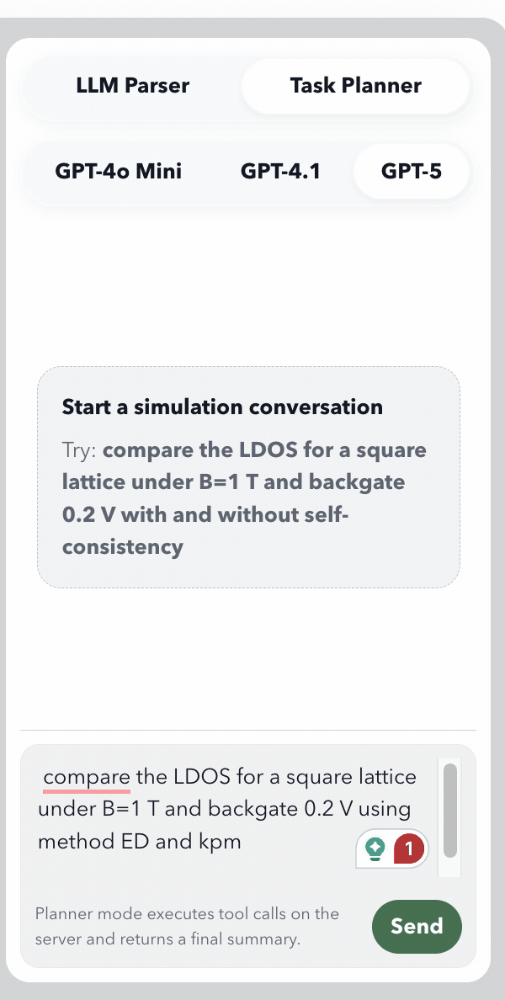
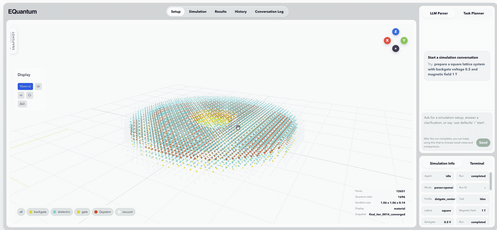
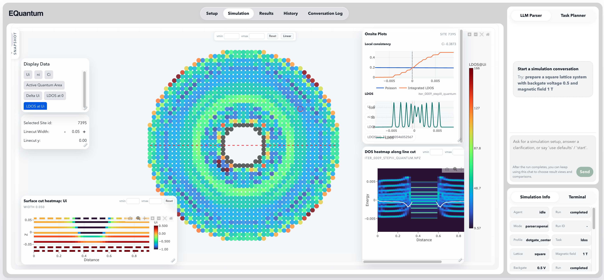

# EQuantumAI

EQuantumAI is a quantum-device simulation workspace that combines:

- a self-consistent quantum-electrostatic solver
- a natural-language agent that turns user requests into simulation specs
- a desktop GUI for interactive runs, clarification, geometry inspection, and solver/result viewing

At a high level, the project lets you go from a request such as:

`calculate the density of states for a square lattice system with backgate voltage 0.5 and magnetic field 1 T`

to:

1. a structured simulation spec
2. a built geometry and initialized quantum system
3. a self-consistent field (FSC) run
4. saved DOS/LDOS artifacts, snapshots, and summaries

## Web App Preview

### Task planner chat workflow



### Geometry viewer



### Quantum viewer snapshot



## Repository Layout

```text
EQuantumAI/
├── Datas/                     # Generated setups, simulation inputs, and run artifacts
├── EQuantum/                  # Core simulation package
│   ├── Equantum/              # Physics engine: System, FSC, solvers
│   ├── agent/                 # Natural-language agent backend
│   ├── Simulation_scripts/    # Batch/scan scripts
│   ├── viewer.py              # Snapshot/log viewer for FSC runs
│   └── README.md              # Package-focused README
├── Interface/                 # Desktop GUI for the agent + simulation workflow
└── README.md                  # This file
```

## Main Components

### 1. Core simulation engine

The simulation core lives under [`EQuantum/Equantum`](/Users/yzaho/Projects/EQuantumAI/EQuantum/Equantum).

Important classes:

- [`System`](/Users/yzaho/Projects/EQuantumAI/EQuantum/Equantum/EQsystem.py) builds the discretized geometry, material assignment, and quantum-system region.
- [`FSC`](/Users/yzaho/Projects/EQuantumAI/EQuantum/Equantum/fsc.py) runs the self-consistent electrostatic/quantum loop.
- the solver modules under [`EQuantum/Equantum/quantum_solvers`](/Users/yzaho/Projects/EQuantumAI/EQuantum/Equantum/quantum_solvers) provide DOS/LDOS and related quantum calculations.

The physics workflow is:

1. Build a `System` from geometry parameters and a setup/config file.
2. Initialize `FSC` with quantum parameters such as magnetic flux.
3. Apply boundary conditions such as backgate voltage, gate potential, and dielectric constant.
4. Run the self-consistent solve loop.
5. Export DOS/LDOS and run summaries.

### 2. Natural-language agent backend

The natural-language interface lives in [`EQuantum/agent/run_nl_query.py`](/Users/yzaho/Projects/EQuantumAI/EQuantum/agent/run_nl_query.py).

This module does three jobs:

- parses user text into a structured simulation spec
- manages a stateful multi-turn clarification workflow
- executes the underlying simulation once the spec is complete and confirmed

Key backend entry points:

- [`start_agent_turn(...)`](/Users/yzaho/Projects/EQuantumAI/EQuantum/agent/run_nl_query.py)
- [`continue_agent_turn(...)`](/Users/yzaho/Projects/EQuantumAI/EQuantum/agent/run_nl_query.py)
- [`run_query(...)`](/Users/yzaho/Projects/EQuantumAI/EQuantum/agent/run_nl_query.py)

Supported tasks currently include:

- `dos`
- `ldos`

The backend can parse and confirm values such as:

- lattice type
- backgate voltage
- magnetic field
- dielectric constant
- gate potential
- `FSC.convergence_tol`
- `FSC.Ncore`
- `eta`
- `ldos_method`

The clarification workflow is stateful rather than one-shot:

1. The first user message is parsed into a partial spec.
2. If required fields are missing, the backend asks a clarification question.
3. If optional runtime values were not explicitly given, the backend proposes current defaults and asks the user to confirm or override them.
4. The backend asks for one final confirmation before running.
5. Only then does the simulation execute.

### 3. Desktop GUI

The desktop interface lives in [`Interface/agent_window.py`](/Users/yzaho/Projects/EQuantumAI/Interface/agent_window.py).

It provides:

- a chat-style conversation panel
- a simulation request composer
- a geometry tab
- a solver viewer tab
- a final result tab
- a right-hand inspection area for run output, spec, and summary

The GUI is connected directly to the same backend session workflow used by the CLI:

- if a request is incomplete, the GUI shows clarification questions
- if a request is complete, the GUI starts the run
- if a run finishes, the GUI loads the final artifacts and summaries

### 4. Snapshot viewer

The FSC snapshot/log viewer lives in [`EQuantum/viewer.py`](/Users/yzaho/Projects/EQuantumAI/EQuantum/viewer.py).

It can be used independently to inspect saved FSC runs and snapshot folders.

## Current built-in profile

At the moment, the main natural-language workflow is centered around the `dotgate_center` profile defined in [`run_nl_query.py`](/Users/yzaho/Projects/EQuantumAI/EQuantum/agent/run_nl_query.py).

That profile defines:

- the geometry sampling function
- the lattice type
- the setup/config location under [`Datas/dotgate_center`](/Users/yzaho/Projects/EQuantumAI/Datas/dotgate_center)
- default boundary-condition values

You can add more profiles by extending the `PROFILES` dictionary in [`run_nl_query.py`](/Users/yzaho/Projects/EQuantumAI/EQuantum/agent/run_nl_query.py).

## How a run works

A typical agent-driven run looks like this:

1. User writes a natural-language request.
2. The backend parses it into a partial spec.
3. Missing or ambiguous values are resolved through clarification turns.
4. The final spec is mapped onto `System` and `FSC`.
5. The FSC solve runs and writes artifacts to disk.
6. The GUI or viewer loads the saved outputs.

Generated artifacts typically include:

- `query_spec.json`
- `run_summary.json`
- `dos.png` / `dos_data.npz`
- `ldos.png` / `ldos_data.npz`
- FSC snapshot `.npz` files for step-by-step runs
- setup-generation files such as `sites.json`, `geoparams_hash.txt`, and Blender-updated `updated_sites_dot.json`

These are usually written under a timestamped folder below:

- [`Datas/dotgate_center/setup/agent_runs`](/Users/yzaho/Projects/EQuantumAI/Datas/dotgate_center/setup)

## Installation Notes

The exact environment will depend on which solvers you want enabled, but the project expects a standard scientific Python stack plus Qt for the GUI.

Common requirements include:

- Python 3.10+
- `numpy`
- `scipy`
- `matplotlib`
- `qtpy`
- a Qt backend such as `PyQt5` or `PySide6`
- `python-dotenv`
- `pydantic`

Optional LLM-related dependencies:

- `langchain-openai` for the LangChain parser mode
- an OpenAI API key for `openai` or `langchain` parser modes

Optional solver dependency:

- `kwant`

If `kwant` is missing, some workflows may still run, but advanced solver features may be unavailable.

## Environment Variables

The agent backend automatically loads `.env` files from the repository root and package folders.

Useful variables:

```env
OPENAI_API_KEY=your_key_here
OPENAI_BASE_URL=https://api.openai.com/v1
EQUANTUM_BLENDER_BIN=blender
EQUANTUM_BLENDER_SCRIPT=/absolute/path/to/your_blender_update_script.py
```

The repository root `.env` is ignored by git.

Optional Blender-command override:

```env
EQUANTUM_BLENDER_FILE=/absolute/path/to/your_geometry.blend
EQUANTUM_BLENDER_COMMAND_TEMPLATE=blender --background "{blend_file}" --python "{script_file}" -- --sites "{sites_file}" --output "{config_file}" --setup-dir "{setup_dir}" --profile "{profile}" --spacing0 "{spacing0}" --density-k "{density_k}"
```

If `EQUANTUM_BLENDER_COMMAND_TEMPLATE` is not set, the backend falls back to a default command shape using `EQUANTUM_BLENDER_BIN`, `EQUANTUM_BLENDER_FILE`, and `EQUANTUM_BLENDER_SCRIPT`.

## Running the project

### 1. Run the desktop GUI

```bash
python Interface/agent_window.py
```

This opens the integrated agent GUI for:

- multi-turn clarification
- interactive simulation launching
- geometry visualization
- solver viewing
- final DOS/LDOS inspection

### 2. Run the natural-language CLI

```bash
python EQuantum/agent/run_nl_query.py \
  "calculate the density of states for a square lattice system with backgate voltage 0.5 and magnetic field 1 T"
```

Useful options:

```bash
python EQuantum/agent/run_nl_query.py --dry-run "calculate DOS for a square lattice"
python EQuantum/agent/run_nl_query.py --parser regex "..."
python EQuantum/agent/run_nl_query.py --parser openai "..."
python EQuantum/agent/run_nl_query.py --parser langchain "..."
```

`--dry-run` is useful for debugging parsing and clarification behavior without executing the simulation.

### 3. Open the FSC viewer directly

```bash
python EQuantum/viewer.py /path/to/run_folder
```

If no folder is provided, it will default to `fsc_logs`.

## Parser modes

The agent backend currently supports three parser modes:

- `regex`
- `openai`
- `langchain`

Recommended behavior:

- use `langchain` or `openai` for more natural multi-turn understanding
- keep `regex` as a deterministic fallback and debugging mode

The current backend is designed to be:

- LLM-first for natural clarification turns
- deterministic for validation, state management, default handling, and execution

## Blender-backed setup generation

For the `dotgate_center` workflow, the backend can also generate a new hashed setup when geometry sampling parameters change.

The flow is:

1. derive the runtime profile from the current spec, including `spacing0` and `k`
2. build the hashed setup folder under [`Datas/dotgate_center/setup`](/Users/yzaho/Projects/EQuantumAI/Datas/dotgate_center/setup)
3. export a fresh `sites.json`
4. invoke Blender in background mode to produce `updated_sites_dot.json`
5. run the simulation from that generated config

This is meant for requests such as:

- `use spacing0 0.015`
- `set k to 0.12`

The repository currently contains the `.blend` files, but not a standalone checked-in Blender assignment script, so the exact Blender-side script/command is expected to be provided through the environment variables above.

## Data and outputs

The repository contains generated data under [`Datas/`](/Users/yzaho/Projects/EQuantumAI/Datas).

This folder may include:

- precomputed setup/config files
- geometry/site files such as `sites.json`
- updated configuration files
- timestamped agent run outputs

Depending on your workflow, this directory can grow quickly.

## Notes on architecture

The project is intentionally split into layers:

- physics layer: `System`, `FSC`, solver modules
- agent/session layer: parsing, clarification, spec management, execution
- GUI layer: interaction model, visualization, and output presentation

That separation makes it easier to:

- add new simulation profiles
- support new NL commands
- replace parser backends
- reuse the same backend from CLI and GUI

## Where to start reading

If you are new to the repository, a good order is:

1. [`README.md`](/Users/yzaho/Projects/EQuantumAI/README.md)
2. [`EQuantum/README.md`](/Users/yzaho/Projects/EQuantumAI/EQuantum/README.md)
3. [`EQuantum/agent/run_nl_query.py`](/Users/yzaho/Projects/EQuantumAI/EQuantum/agent/run_nl_query.py)
4. [`Interface/agent_window.py`](/Users/yzaho/Projects/EQuantumAI/Interface/agent_window.py)
5. [`EQuantum/Equantum/EQsystem.py`](/Users/yzaho/Projects/EQuantumAI/EQuantum/Equantum/EQsystem.py)
6. [`EQuantum/Equantum/fsc.py`](/Users/yzaho/Projects/EQuantumAI/EQuantum/Equantum/fsc.py)

## Status

This repository is an active research/development workspace rather than a polished packaged application. The codebase already supports real interactive runs, but it is still evolving quickly, especially in:

- GUI layout and UX
- profile support
- parser/agent behavior
- runtime configuration through natural language

That said, the current stack is already usable for the main `dotgate_center` workflow.
